<div align="center">
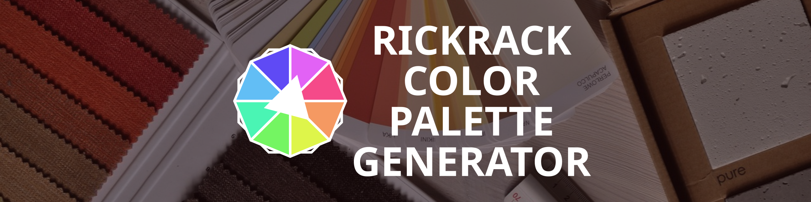
<br/><br/>
Rickrack<br/>焰火十二卷<br/> ----- ----- ----- ----- ----- ----- ----- ----- <br/>
Generate Harmonious Colors Freely.<br/>自由自在生成和谐色彩。
<br/><br/>
[<a href="https://eigenmiao.com/rickrack">:globe_with_meridians: English</a>] | [<a href="https://eigenmiao.com/yanhuo">:globe_with_meridians: 中文</a>] | [<a href="https://eigenmiao.com/yanhuo/eo.html">:globe_with_meridians: Esperanto</a>] | [<a href="https://eigenmiao.com/yanhuo/ru.html">:globe_with_meridians: Русский</a>] | [<a href="https://eigenmiao.com/yanhuo/ja.html">:globe_with_meridians: 日本語</a>] | [<a href="https://eigenmiao.com/yanhuo/fr.html">:globe_with_meridians: Français</a>] | [<a href="https://eigenmiao.com/yanhuo/de.html">:globe_with_meridians: Deutsch</a>] | [<a href="https://eigenmiao.com/yanhuo/es.html">:globe_with_meridians: Español</a>]
<br/><br/>
</div>

# Rickrack
In the age of digital creativity, the color palette has become an indispensable tool for designers. A good color palette can make a design more attractive and coordinated. Rickrack is designed for you if you are looking for an excellent color palette software! Rickrack has various color mixing functions and is suitable for various scenes. Rickrack is easy to use, and more importantly, it's completely free without networking or registration required.

Rickrack (**R**e**a**l-t**i**me **C**olor **K**it) is a free and user-friendly color editor. It is designed to generate a set of harmonious colors from the color wheel or other places. You can share these colors with your friends, or apply them into your creative works. What’s more, you can export them into individual files and import them into other softwares such as Adobe Photoshop, GIMP, Krita, Pencil 2D and Clip Studio Paint. Rickrack can run normally on operating systems such as Windows, Linux, and macOS.

<div><a target="_Blank" href="https://www.youtube.com/watch?v=E-BT1dnJvw8">
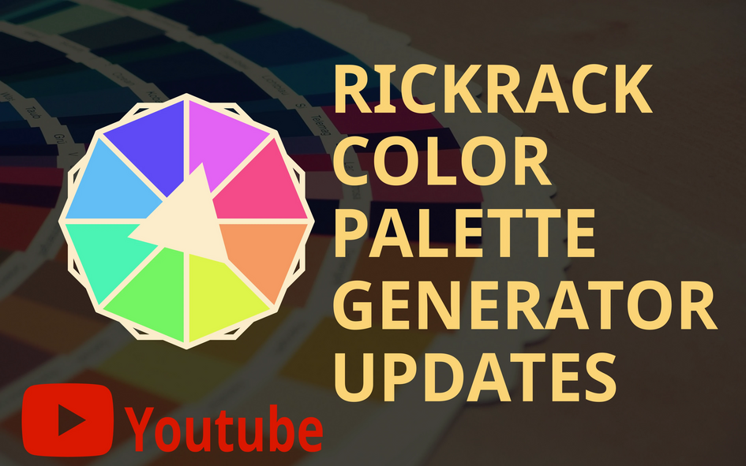
</a></div>

[:rocket: v2.9.9 Update Notes](https://github.com/eigenmiao/Rickrack/releases/tag/v2.9.9)

[:house: Rickrack](https://eigenmiao.com/rickrack)

# 焰火十二卷
在数字创意的时代，调色板成为了设计师不可或缺的工具。一个好的调色板可以让设计更加有吸引力和协调性。如果你正在寻找一款优秀的调色板软件，那就试试焰火十二卷吧！焰火十二卷具有多种配色功能，适用于多种场景。焰火十二卷简单易上手，更重要的是，它完全免费，无需联网或注册。

焰火十二卷（实时色彩工具箱）是一款免费且实用的色彩编辑器。它可以帮助你从色轮或者其他地方生成一组和谐的色彩。你可以将这些色彩分享给其他人，或者应用到你自己的创作当中。此外，你也可以将色彩组或者色库导出为单独的色彩文档并导入其他软件中（如 Adobe Photoshop、GIMP、Krita、Pencil 2D 以及优动漫 Paint 等）。焰火十二卷可以在 Windows、Linux、macOS 等操作系统上正常运行。

<div><a target="_Blank" href="https://www.bilibili.com/video/BV1tM4y1s7RN/">
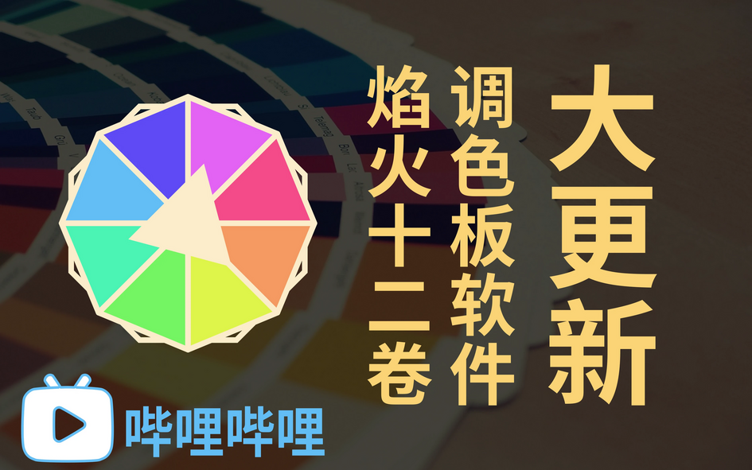
</a></div>

[:rocket: v2.9.9 更新说明](https://github.com/eigenmiao/Rickrack/releases/tag/v2.9.9)

[:house: 焰火十二卷](https://eigenmiao.com/yanhuo)

# Table of Content
* [Features](#features)
* [Demo](#demo)
  * [Basic Functions](#basic-functions)
  * [Reference Colors](#reference-colors)
  * [Color Palettes](#color-palettes)
  * [Export and Import Colors](#export-and-import-colors)
  * [Languages and Settings](#languages-and-settings)
* [Information](#information)
  * [Website](#website)
  * [Repository](#repository)
  * [Author](#author)
* [Installation](#installation)
  * [Current Release](#current-release)
  * [Download Software](#download-software)
  * [Install Software](#install-software)
  * [Install Module](#install-module)
* [Usage](#usage)
  * [How to Use the Software](#how-to-use-the-software)
  * [How to Use the Module](#how-to-use-the-module)
* [Development](#development)
  * [Install Requirement](#install-requirement)
  * [How to Build the Software](#how-to-build-the-software)
  * [How to Build the Module](#how-to-build-the-module)
* [Copyright](#copyright)
* [License](#license)
  * [License for Rickrack](#license-for-rickrack)
  * [License for Required Packages](#license-for-required-packages)
* [Contributing](#contributing)
* [More Information](#more-information)
* [Acknowledgment](#acknowledgment)

# Features
Rickrack has several features:
* A strong and free color editor.
* Create a set of colors from the color wheel.
* Pick-up a set of colors from an image.
* Generate a color board from the color set.
* Attach the color set and color board into the depot.
* Import colors from elsewhere and manage them in depot.
* Export colors and import them into other image processors.
* Obtain colors through the Python module in real-time.
* No function limitations and no registration required.
* ... and more!

<div align="right"><a href="#table-of-content">:arrow_up: Back to TOC  :arrow_up:</a></div>

# Demo
## Basic Functions
|     |     |
| :---: | :---: |
| 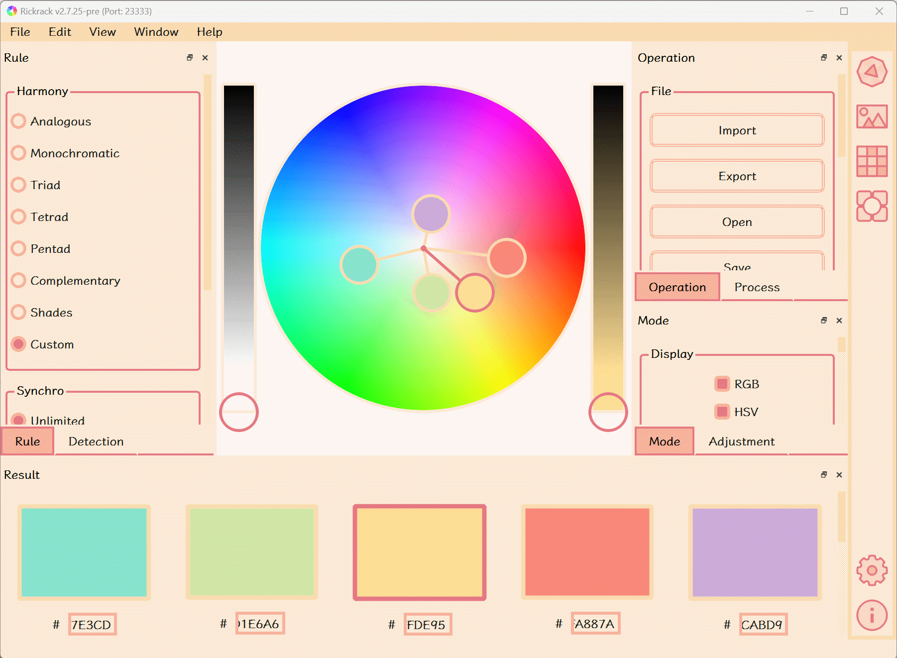 | 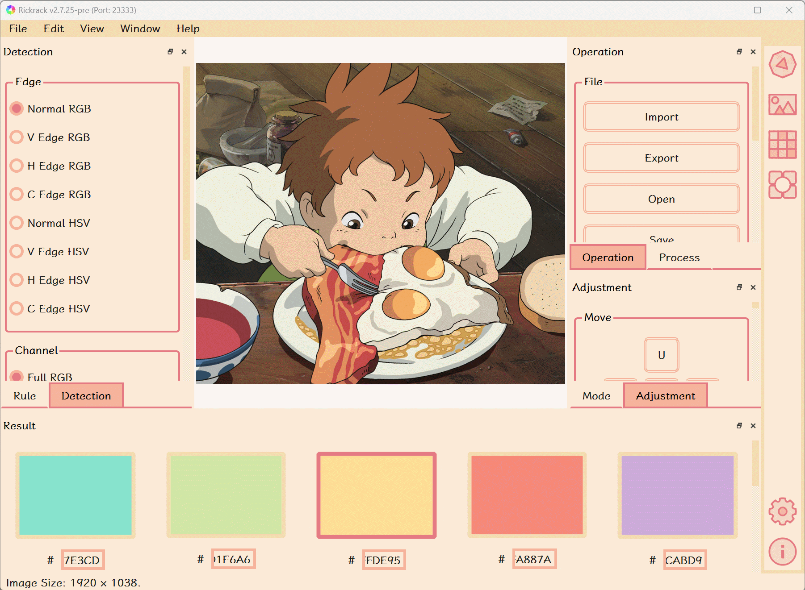 |
| Create a set of colors from the color wheel. | Pick-up a set of colors from an image. (Image inside: [Copyright (c) 2001 Studio Ghibli](https://www.ghibli.jp/works/chihiro/), Non-Commercial Usage) |
| 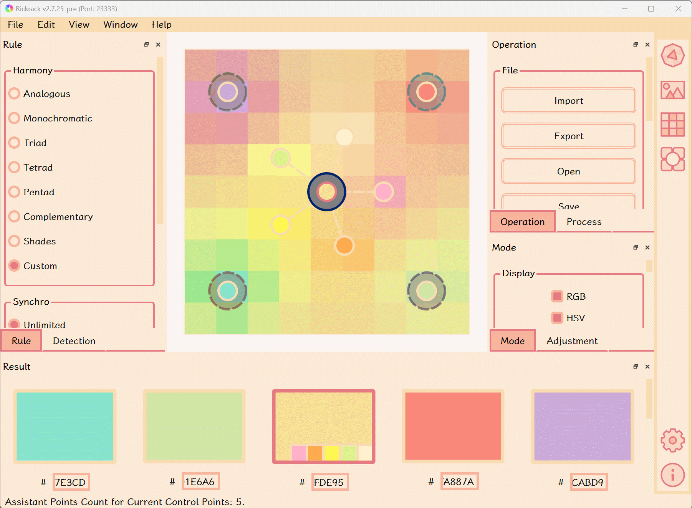 | 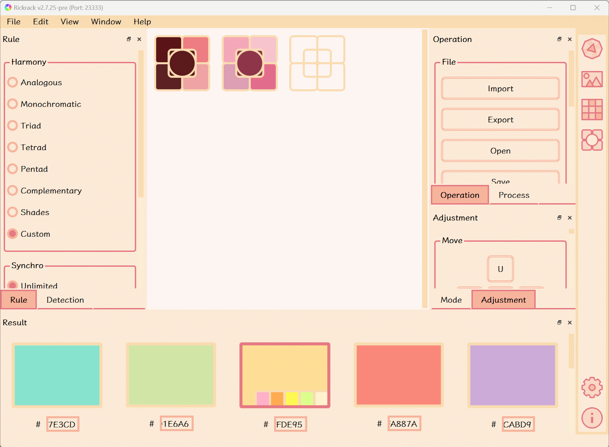 |
| Generate a gradient color board from the color set. | Attach the color set and color board into the depot. |

## Reference Colors
|     |     |
| :---: | :---: |
| 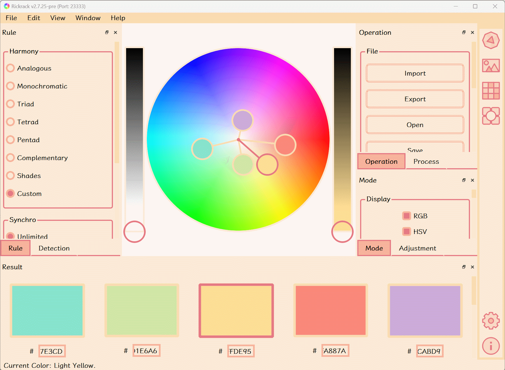 | 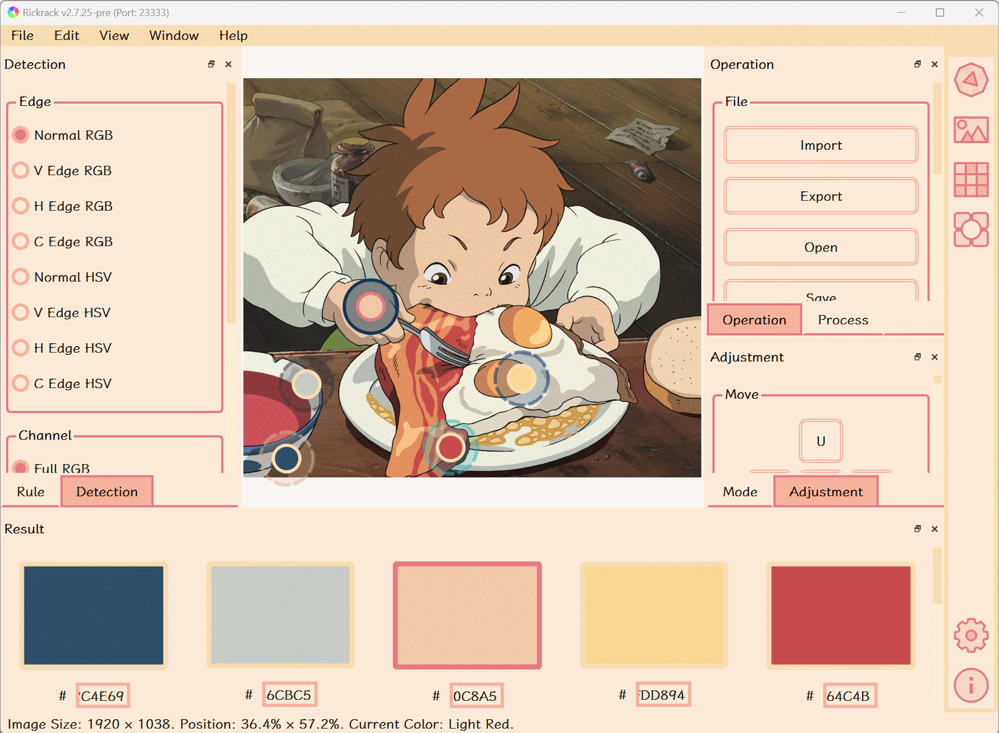 |
| Add reference colors in the color wheel. | Add reference colors from the image. (Image inside: [Copyright (c) 2001 Studio Ghibli](https://www.ghibli.jp/works/chihiro/), Non-Commercial Usage) |

## Color Palettes
|     |     |
| :---: | :---: |
|  |  |
| Convert: gradient palette &harr; fixed palette. | Convert: gradient palette &harr; reference palette. |
| 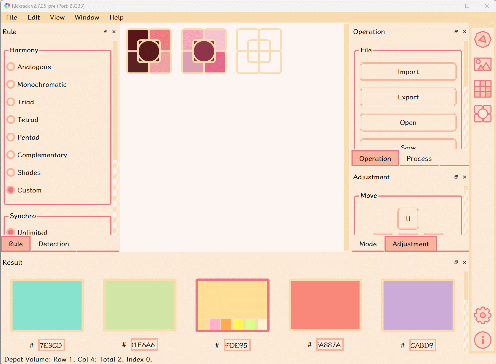 | 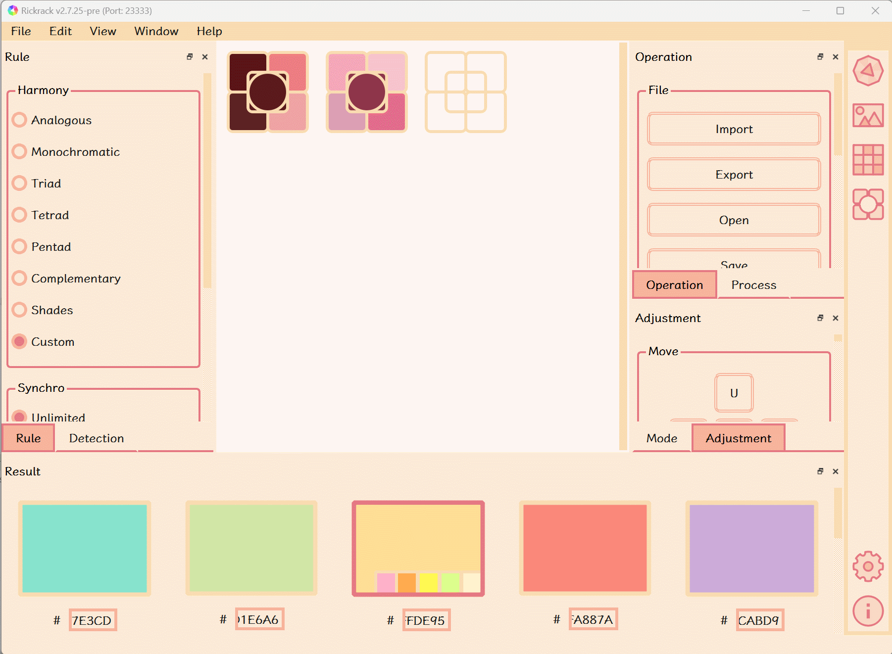 |
| Fixed palette: [Chinese Traditional Colors](http://zhongguose.com/). | Fixed palette: [Nippon Traditional Colors](http://nipponcolors.com/). |

## Languages and Settings
|     |     |
| :---: | :---: |
| 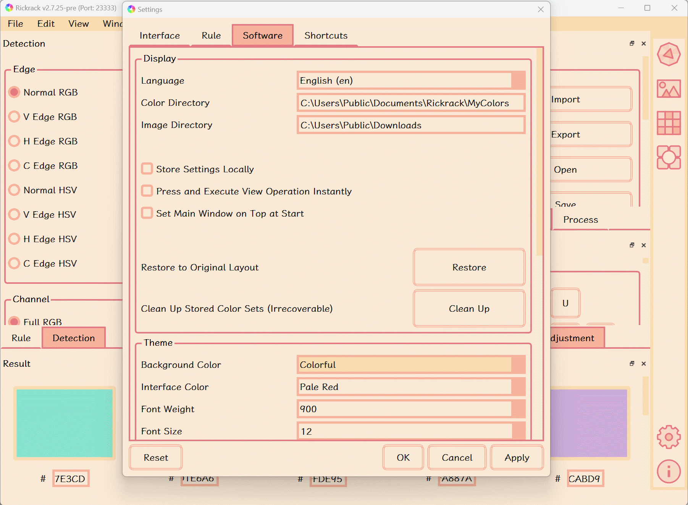 | 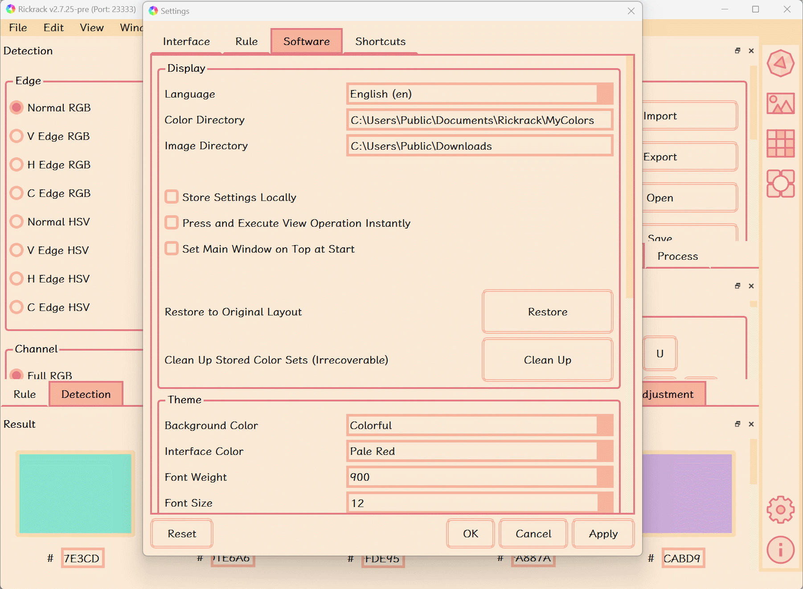 |
| Support multiple languages, including Chinese, English, Japanese, German, French, Russian, and so on. (Languages except Chinese and English are translated by [Google Translate](https://translate.google.cn/).) | Support multiple interface themes. |

<div align="right"><a href="#table-of-content">:arrow_up: Back to TOC  :arrow_up:</a></div>

# Information
## Website
https://eigenmiao.com/rickrack

## Repository
https://github.com/eigenmiao/Rickrack

## Author
[Eigenmiao](mailto:eigenmiao@outlook.com)

# Installation
## Current Release
The latest preview version is [v2.9.9](https://github.com/eigenmiao/Rickrack/releases/tag/v2.9.9).

## Install Software
### Recommend: Install on Windows 10 or 11 via WinGet tool
```
winget install rickrack
```

### Recommend: Install on Linux via Snapcraft tool
```
snap install rickrack
```

## Install on other platforms
Download Software from [Github](https://github.com/eigenmiao/Rickrack/releases/tag/v2.9.9) or [Sourceforge](https://sourceforge.net/projects/rickrack/files/v2.9.9/). The installation steps are presented in [tutorials](https://eigenmiao.com/2021/12/12/rickrack-tutorial-en-v2.3.4/#Installation).

Here is a [video tutorial](https://www.bilibili.com/video/BV17r4y1L7R6/).

## Install Module
Install the latest [Rickrack](https://pypi.org/project/Rickrack/) from PyPI!

```Bash
# Install Rickrack.
pip install Rickrack

# Start the installed software.
rickrack -d "/PATH/TO/RICKRACK/SOFTWARE"
```

<div align="right"><a href="#table-of-content">:arrow_up: Back to TOC  :arrow_up:</a></div>

# Usage
* [Documentation](https://eigenmiao.com/2021/12/12/rickrack-tutorial-en-v2.3.4/) / [文档](https://eigenmiao.com/2021/12/12/rickrack-tutorial-zh-v2.3.4/)
* [Video Tutorials](https://space.bilibili.com/390426743) / [视频教程](https://space.bilibili.com/390426743)

## How to Use the Software
Visit https://eigenmiao.com/rickrack/ for tutorials. Just feel free to click anywhere in the interface!

Here is a [video tutorial](https://www.bilibili.com/video/BV1BM411L75t/).

Here is a [demo](https://eigenmiao.com/2023/01/29/color-palette-generator-rickrack-en/).

## How to Use the Module
Include Rickrack in other Python scripts, programs and softwares!

Here is a [video tutorial](https://www.bilibili.com/video/BV1VD4y157tX/).

Here is a [demo](demo/03_plot_scripts).

```Python
# Use Rickrack module in code.
# This code fragment could be reused.

from rickrack import Rickrack

# Init Rickrack.
rr = Rickrack()

# Display the help information.
dp_proj = "/PATH/TO/RICKRACK/PROJECT"
dp_argv = dict()
dp_argv["help"] = True

# Run and see the full contents and examples.
rr.run(dp_argv=dp_argv, dp_proj=dp_proj)
```

<div align="right"><a href="#table-of-content">:arrow_up: Back to TOC  :arrow_up:</a></div>

# Development
## Install Requirement
* Python 3.6
* Git version control system
* Additional modules listed in the requirements folder

## How to Build the Software
```bash
# Download the Rickrack source code.
git clone https://github.com/eigenmiao/Rickrack.git

# Change into the directory.
cd Rickrack

# Install the Rickrack starter.
pip install rickrack

# Display the help information.
rickrack -h

# Run Rickrack.
rickrack -d .
```

## How to Build the Module
```bash
# Download the Rickrack source code.
git clone https://github.com/eigenmiao/Rickrack.git

# Change into the directory.
cd Rickrack

# Generate the package for Rickrack.
python setup.py sdist --formats=gztar,zip
```

<div align="right"><a href="#table-of-content">:arrow_up: Back to TOC  :arrow_up:</a></div>

# Copyright
Copyright (c) 2019-2023 [Eigenmiao](mailto:eigenmiao@outlook.com). All Rights Reserved.

<div align="right"><a href="#table-of-content">:arrow_up: Back to TOC  :arrow_up:</a></div>

# License
## License for Rickrack
Rickrack is a free software, which is distributed in the hope that it will be useful, but without any warranty. You can redistribute it and/or modify it under the terms of the GNU General Public License as published by the Free Software Foundation. See the [GNU General Public License 3.0 (GPLv3)](https://www.gnu.org/licenses/) for more details.

All images, documents and translations in Rickrack [code repository](https://github.com/eigenmiao/Rickrack) are licensed under [Creative Commons Attribution-NonCommercial-ShareAlike License 4.0 (CC BY-NC-SA 4.0)](https://creativecommons.org/licenses/by-nc-sa/4.0/) unless stating additionally.

Rickrack default uses [Noto Sans](https://fonts.google.com/noto) font family for interface display. These fonts are open-sourced under [SIL Open Font License 1.1](http://scripts.sil.org/OFL). Rickrack only carries basic fonts. All fonts can be downloaded here: [all fonts](https://fonts.google.com/noto/fonts).

## License for Required Packages
| Package        | License          | Package        | License          |
|----------------|------------------|----------------|------------------|
| altgraph       | MIT              | pip            | MIT              |
| fbs            | GPLv3 or Later   | PyInstaller    | GPLv2 or Later   |
| future         | MIT              | PyQt5          | GPLv3            |
| lxml           | BSD              | PyQt5_sip      | SIP              |
| macholib       | MIT              | pywin32        | PSF              |
| numpy          | BSD              | pywin32-ctypes | BSD              |
| pefile         | MIT              | setuptools     | MIT              |
| Pillow         | HPND             | swatch         | MIT              |

<div align="right"><a href="#table-of-content">:arrow_up: Back to TOC  :arrow_up:</a></div>

# Contributing
Welcome to participate in community discussions, report bugs and submit feature-requests. / 欢迎参与社区讨论、报告错误和提交功能请求。

<div align="right"><a href="#table-of-content">:arrow_up: Back to TOC  :arrow_up:</a></div>

# More Information
* The installation package can be unzipped and run directly. This method does not require administrator privileges and can solve some installation failure problems.
* The socket server is designed for obtaining colors from the Rickrack software in real-time. By default, this server is disabled and can only be started from the command line.
* The software documentation is here: https://eigenmiao.com/2021/12/12/rickrack-tutorial-en-v2.3.4/ .
* The video tutorials are here: https://space.bilibili.com/390426743 .
* Rickrack is written in [Python](https://www.python.org/), constructed based on [PyQt5](https://www.qt.io/qt-for-python) and packed up by [fbs (free edition)](https://build-system.fman.io/).
* The code repository of Rickrack is deposited on [Github](https://github.com/eigenmiao/Rickrack) and [Gitee](https://gitee.com/eigenmiao/Rickrack).
* The localization (l10n) and internationalization (i18n) of Rickrack is based on [Google Translate](https://translate.google.cn/) and [Microsoft Translator](https://cn.bing.com/translator), deployed on [POEditor](https://poeditor.com/join/project?hash=kBeQjfxCES).
* Some icons come from the [RemixIcon](https://remixicon.cn/).
* Some demo images come from the [Ghibli](https://www.ghibli.jp/info/013409/).
* Some cover images come from the Pixabay: [Pixabay Image created by Martynaszulist](https://pixabay.com/zh/photos/pattern-the-palette-web-1508277/), [Pixabay Image created by Martynaszulist](https://pixabay.com/zh/photos/interior-design-web-fabrics-pattern-1508276/), [Pixabay Image created by StockSnap](https://pixabay.com/zh/photos/colors-colours-swatch-925467/).

<div align="right"><a href="#table-of-content">:arrow_up: Back to TOC  :arrow_up:</a></div>

# Acknowledgment
Thanks to everyone who likes Rickrack. / 感谢所有喜欢焰火十二卷的人。

Thanks to all communities and websites that have provided valuable spaces for discussing and showcasing Rickrack. / 感谢所有为讨论和展示焰火十二卷提供了宝贵空间的社区和网站。

Thanks to the following websites for providing display spaces: / 感谢以下网站提供的展示空间：[HelloGithub](https://hellogithub.com/repository/a5944a28506c4207a75f4bfb561e8e80)、[Snapcraft](https://snapcraft.io/rickrack)、[科技爱好者周刊（第 264 期）](https://www.ruanyifeng.com/blog/2023/07/weekly-issue-264.html)、[小众软件](https://www.appinn.com/rickrack/)、[星火应用商店](https://www.spark-app.store/store/application/rickrack)、[AlternativeTo](https://alternativeto.net/software/rickrack/about/)、[discuss.pencil2d.org](https://discuss.pencil2d.org/t/crafting-a-distinctive-color-palette-for-pencil2d-enthusiasts/)、[discuss.pixls.us](https://discuss.pixls.us/t/crafting-distinctive-color-palettes-for-gimp-enthusiasts/)、[krita-artists.org](https://krita-artists.org/t/alternatives-to-adobe-color-rickrack/)、[Softpedia](https://www.softpedia.com/get/Multimedia/Graphic/Graphic-Others/RickRack.shtml)、[少数派](https://sspai.com/u/eigenmiao)、[OSChina](https://www.oschina.net/p/haworthia-the-firework)、[SourceForge](https://sourceforge.net/projects/rickrack/)、[哔哩哔哩](https://space.bilibili.com/390426743)。

<div align="right"><a href="#rickrack">:arrow_up: Back to Top :arrow_up:</a> <a href="#table-of-content">:arrow_up: Back to TOC  :arrow_up:</a></div>
