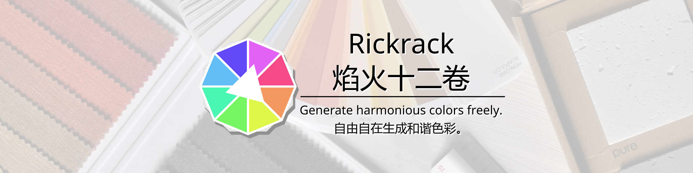
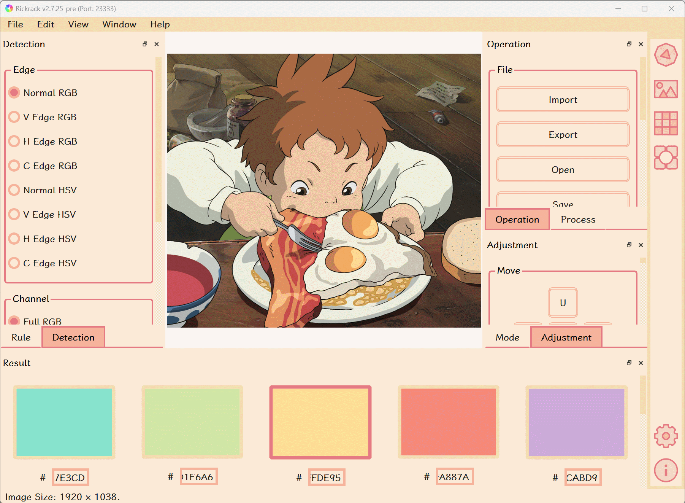
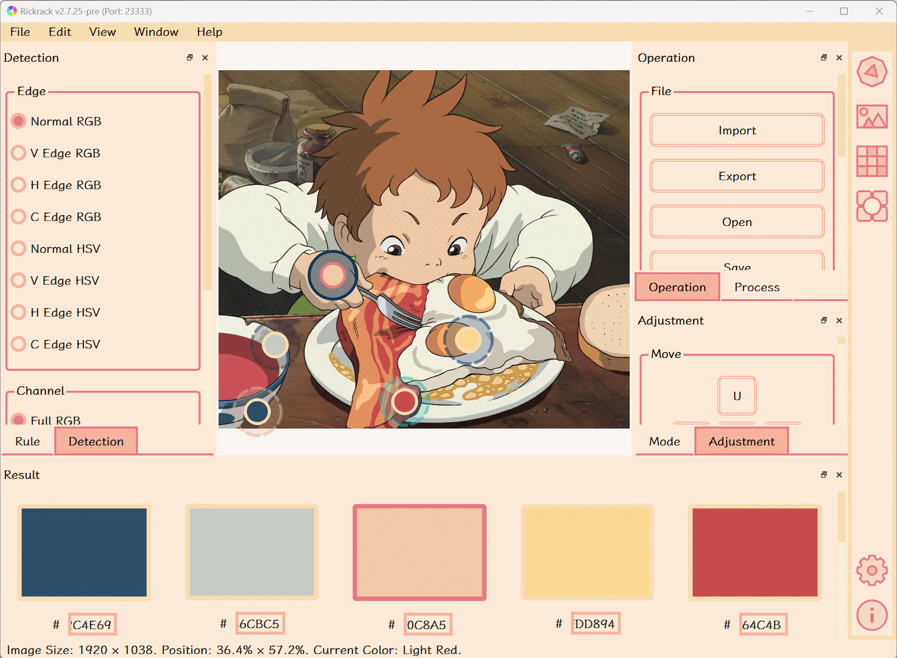
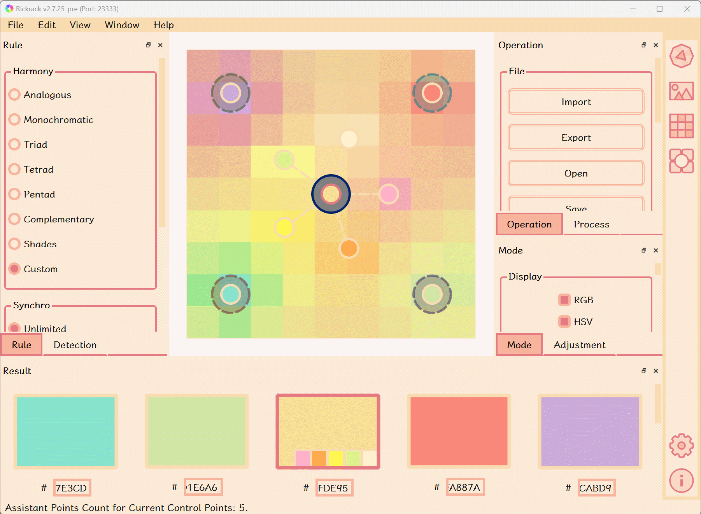
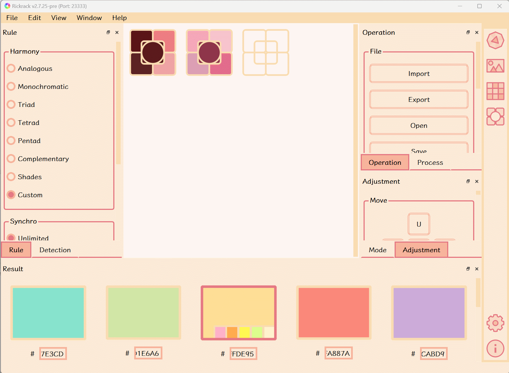
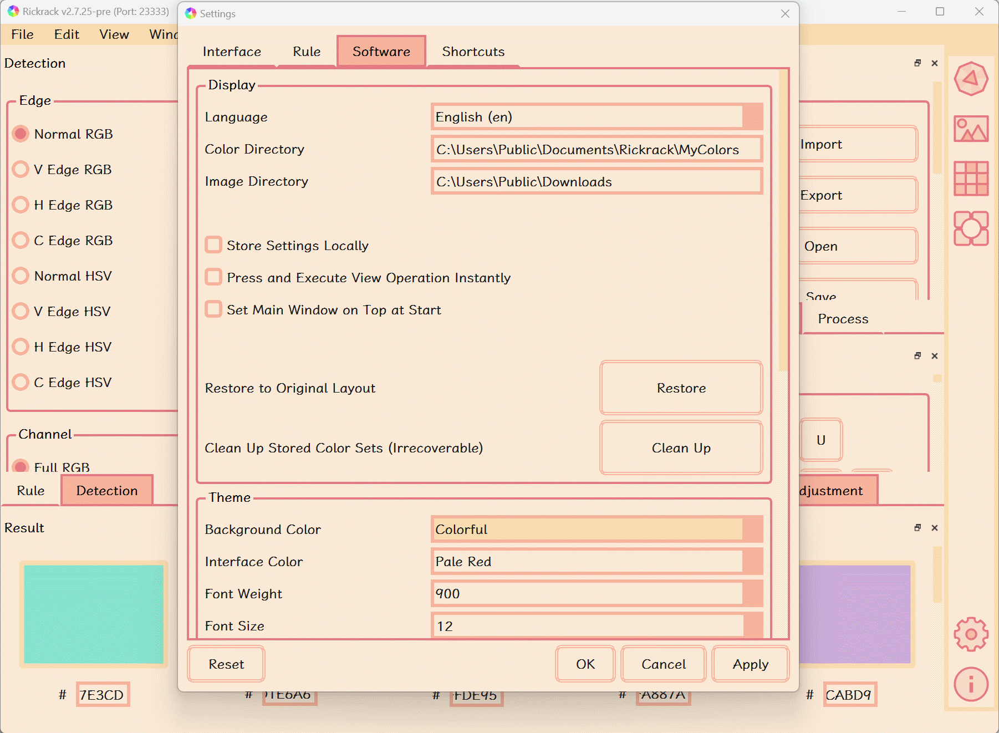
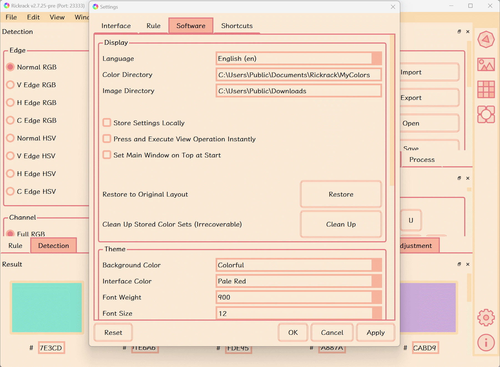

<div align="center">

<br/><br/>
Rickrack<br/>焰火十二卷<br/> ----- ----- ----- ----- ----- ----- ----- ----- <br/>
Generate Harmonious Colors Freely.<br/>自由自在生成和谐色彩。
<br/><br/>
[<a href="https://eigenmiao.com/rickrack">:globe_with_meridians: English</a>] | [<a href="https://eigenmiao.com/yanhuo">:globe_with_meridians: 中文</a>] | [<a href="https://eigenmiao.com/yanhuo/eo.html">:globe_with_meridians: Esperanto</a>] | [<a href="https://eigenmiao.com/yanhuo/ru.html">:globe_with_meridians: Русский</a>] | [<a href="https://eigenmiao.com/yanhuo/ja.html">:globe_with_meridians: 日本語</a>] | [<a href="https://eigenmiao.com/yanhuo/fr.html">:globe_with_meridians: Français</a>] | [<a href="https://eigenmiao.com/yanhuo/de.html">:globe_with_meridians: Deutsch</a>] | [<a href="https://eigenmiao.com/yanhuo/es.html">:globe_with_meridians: Español</a>]
<br/><br/>
</div>

# Rickrack
In the age of digital creativity, the color palette has become an indispensable tool for designers. A good color palette can make a design more attractive and coordinated. Rickrack is designed for you if you are looking for an excellent color palette software! Rickrack has various color mixing functions and is suitable for various scenes. Rickrack is easy to use, and more importantly, it's completely free without networking or registration required.

Rickrack (**R**e**a**l-t**i**me **C**olor **K**it) is a free and user-friendly color editor. It is designed to generate a set of harmonious colors from the color wheel or other places. You can share these colors with your friends, or apply them into your creative works. What’s more, you can export them into individual files and import them into other softwares such as Adobe Photoshop, GIMP, Krita, Pencil 2D and Clip Studio Paint. Rickrack can run normally on operating systems such as Windows, Linux, and macOS.

[:house: Rickrack](https://eigenmiao.com/rickrack)

[:arrow_down: Translations of the Introduction in Other Languages :arrow_down:](#introduction-translations)

# 焰火十二卷
在数字创意的时代，调色板成为了设计师不可或缺的工具。一个好的调色板可以让设计更加有吸引力和协调性。如果你正在寻找一款优秀的调色板软件，那就试试焰火十二卷吧！焰火十二卷具有多种配色功能，适用于多种场景。焰火十二卷简单易上手，更重要的是，它完全免费，无需联网或注册。

焰火十二卷（实时色彩工具箱）是一款免费且实用的色彩编辑器。它可以帮助你从色轮或者其他地方生成一组和谐的色彩。你可以将这些色彩分享给其他人，或者应用到你自己的创作当中。此外，你也可以将色彩组或者色彩仓库导出为单独的色彩文档并导入其他软件中（如 Adobe Photoshop、GIMP、Krita、Pencil 2D 以及优动漫 Paint 等）。焰火十二卷可以在 Windows、Linux、macOS 等操作系统上正常运行。

[:house: 焰火十二卷](https://eigenmiao.com/yanhuo)

[:arrow_down: 简介的其他语言翻译 :arrow_down:](#introduction-translations)

# Table of Content
* [Introduction Translations](#introduction-translations)
* [Feature](#feature)
* [Demo](#demo)
  * [Basic Functions](#basic-functions)
  * [Reference Colors](#reference-colors)
  * [Color Palettes](#color-palettes)
  * [Export and Import Colors](#export-and-import-colors)
  * [Languages and Settings](#languages-and-settings)
* [Reviews about Rickrack](#reviews-about-rickrack)
* [Information](#information)
  * [Website](#website)
  * [Repository](#repository)
  * [Author](#author)
  * [Support](#support)
* [Installation](#installation)
  * [Current Release](#current-release)
  * [Download Software](#download-software)
  * [Install Software](#install-software)
  * [Install Module](#install-module)
* [Usage](#usage)
  * [How to Use the Software](#how-to-use-the-software)
  * [How to Use the Module](#how-to-use-the-module)
* [Development](#development)
  * [Install Requirement](#install-requirement)
  * [How to Build the Software](#how-to-build-the-software)
  * [How to Build the Module](#how-to-build-the-module)
* [Copyright](#copyright)
* [License](#license)
  * [License for Rickrack](#license-for-rickrack)
  * [License for Required Packages](#license-for-required-packages)
* [Acknowledgment](#acknowledgment)

# Introduction Translations
## Rickrack (Esperanto)
En la epoko de cifereca kreemo, la kolora paletro fariĝis nemalhavebla ilo por dezajnistoj. Bona kolora paletro povas fari dezajnon pli alloga kaj kunordigita. Rickrack estas desegnita por vi, se vi serĉas bonegan programaron de kolora paletro! Rickrack havas diversajn kolorajn miksajn funkciojn kaj taŭgas por diversaj scenoj. Rickrack estas facile uzebla, kaj pli grave, ĝi estas tute senpaga sen interkonektado aŭ registriĝo necesa.

Rickrack estas senpaga kaj amika kolorredaktilo. Ĝi estas desegnita por generi aron da harmoniaj koloroj de la kolorrado aŭ aliaj lokoj. Vi povas dividi ĉi tiujn kolorojn kun viaj amikoj, aŭ apliki ilin en viajn kreajn verkojn. Krome, vi povas eksporti ilin en individuajn dosierojn kaj importi ilin en aliajn programojn kiel Adobe Photoshop, GIMP, Krita, Pencil 2D kaj Clip Studio Paint. Rickrack povas funkcii normale per operaciumoj kiel Vindozo, Linukso kaj macOS.

(Tradukoj supre baziĝas sur Google Translate.)

[:house: Rickrack](https://eigenmiao.com/yanhuo/eo.html)

## Rickrack (Русский)
В век цифрового творчества цветовая палитра стала незаменимым инструментом для дизайнеров. Хорошая цветовая палитра может сделать дизайн более привлекательным и гармоничным. Rickrack разработан для вас, если вы ищете отличное программное обеспечение для цветовой палитры! Rickrack имеет различные функции смешивания цветов и подходит для различных сцен. Rickrack прост в использовании и, что более важно, совершенно бесплатен, не требует подключения к сети или регистрации.

Rickrack — бесплатный и удобный редактор цветов. Он предназначен для создания набора гармоничных цветов из цветового круга или других мест. Вы можете поделиться этими цветами с друзьями или применить их в своих творческих работах. Более того, вы можете экспортировать их в отдельные файлы и импортировать в другие программы, такие как Adobe Photoshop, GIMP, Krita, Pencil 2D и Clip Studio Paint. Rickrack может нормально работать в таких операционных системах, как Windows, Linux и macOS.

(Переводы выше основаны на Google Translate.)

[:house: Rickrack](https://eigenmiao.com/yanhuo/ru.html)

## 焰火十二卷（日本語）
デジタルクリエイティビティの時代において、カラーパレットはデザイナーにとって不可欠なツールとなっています。 優れたカラーパレットは、デザインをより魅力的で調和のとれたものにすることができます。 焰火十二卷は、優れたカラー パレット ソフトウェアをお探しの方のために設計されました。 焰火十二卷は多彩なカラーミキシング機能を備え、さまざまなシーンに最適です。 焰火十二卷は使いやすく、さらに重要なことに、ネットワークや登録は不要で完全に無料です。

焰火十二卷は、無料で使いやすいカラー エディターです。 カラーホイールまたはその他の場所から調和のとれた色のセットを生成するように設計されています。 これらの色を友達と共有したり、クリエイティブな作品に適用したりできます。 さらに、それらを個別のファイルにエクスポートして、Adobe Photoshop、GIMP、Krita、Pencil 2D、Clip Studio Paint などの他のソフトウェアにインポートすることもできます。 焰火十二卷は、Windows、Linux、macOS などのオペレーティング システムで通常どおり実行できます。

（上記の翻訳はGoogle翻訳に基づいています。）

[:house: 焰火十二卷](https://eigenmiao.com/yanhuo/ja.html)

## Rickrack (Français)
À l'ère de la créativité numérique, la palette de couleurs est devenue un outil indispensable pour les designers. Une bonne palette de couleurs peut rendre un design plus attrayant et coordonné. Rickrack est conçu pour vous si vous recherchez un excellent logiciel de palette de couleurs ! Rickrack a diverses fonctions de mélange de couleurs et convient à diverses scènes. Rickrack est facile à utiliser et, plus important encore, il est entièrement gratuit, sans mise en réseau ni inscription requise.

Rickrack est un éditeur de couleurs gratuit et convivial. Il est conçu pour générer un ensemble de couleurs harmonieuses à partir de la roue chromatique ou d'autres endroits. Vous pouvez partager ces couleurs avec vos amis ou les appliquer dans vos créations. De plus, vous pouvez les exporter dans des fichiers individuels et les importer dans d'autres logiciels tels que Adobe Photoshop, GIMP, Krita, Pencil 2D et Clip Studio Paint. Rickrack peut fonctionner normalement sur des systèmes d'exploitation tels que Windows, Linux et macOS.

(Les traductions ci-dessus sont basées sur Google Translate.)

[:house: Rickrack](https://eigenmiao.com/yanhuo/fr.html)

## Rickrack (Deutsch)
Im Zeitalter der digitalen Kreativität ist die Farbpalette zu einem unverzichtbaren Werkzeug für Designer geworden. Eine gute Farbpalette kann ein Design attraktiver und koordinierter machen. Rickrack ist genau das Richtige für Sie, wenn Sie auf der Suche nach einer hervorragenden Farbpalettensoftware sind! Rickrack verfügt über verschiedene Farbmischfunktionen und ist für verschiedene Szenen geeignet. Rickrack ist einfach zu bedienen und, was noch wichtiger ist, es ist völlig kostenlos, ohne dass eine Vernetzung oder Registrierung erforderlich ist.

Rickrack ist ein kostenloser und benutzerfreundlicher Farbeditor. Es wurde entwickelt, um aus dem Farbkreis oder anderen Stellen eine Reihe harmonischer Farben zu erzeugen. Sie können diese Farben mit Ihren Freunden teilen oder sie in Ihren kreativen Arbeiten anwenden. Darüber hinaus können Sie sie in einzelne Dateien exportieren und in andere Softwareprogramme wie Adobe Photoshop, GIMP, Krita, Pencil 2D und Clip Studio Paint importieren. Rickrack kann normal auf Betriebssystemen wie Windows, Linux und macOS ausgeführt werden.

(Die oben genannten Übersetzungen basieren auf Google Translate.)

[:house: Rickrack](https://eigenmiao.com/yanhuo/de.html)

## Rickrack (Español)
En la era de la creatividad digital, la paleta de colores se ha convertido en una herramienta indispensable para los diseñadores. Una buena paleta de colores puede hacer que un diseño sea más atractivo y coordinado. ¡Rickrack está diseñado para usted si está buscando un excelente software de paleta de colores! Rickrack tiene varias funciones de mezcla de colores y es adecuado para varias escenas. Rickrack es fácil de usar y, lo que es más importante, es completamente gratuito sin necesidad de redes o registro.

Rickrack es un editor de color gratuito y fácil de usar. Está diseñado para generar un conjunto de colores armoniosos a partir de la rueda de colores u otros lugares. Puede compartir estos colores con sus amigos o aplicarlos en sus trabajos creativos. Además, puede exportarlos a archivos individuales e importarlos a otros programas como Adobe Photoshop, GIMP, Krita, Pencil 2D y Clip Studio Paint. Rickrack puede ejecutarse normalmente en sistemas operativos como Windows, Linux y macOS.

(Las traducciones anteriores se basan en Google Translate.)

[:house: Rickrack](https://eigenmiao.com/yanhuo/es.html)

<div align="right"><a href="#table-of-content">:arrow_up: Back to TOC  :arrow_up:</a></div>

# Feature
Rickrack has several features:
* A strong and free color editor.
* Create a set of colors from the color wheel.
* Pick-up a set of colors from an image.
* Generate a color board from the color set.
* Attach the color set and color board into the depot.
* Import colors from elsewhere and manage them in depot.
* Export colors and import them into other image processors.
* Obtain colors through the Python module in real-time.
* No function limitations and no registration required.
* ... and more!

<div align="right"><a href="#table-of-content">:arrow_up: Back to TOC  :arrow_up:</a></div>

# Demo
## Basic Functions
|     |     |
| :---: | :---: |
|  |  |
| Create a set of colors from the color wheel. | Pick-up a set of colors from an image. (Image inside: [Copyright (c) 2001 Studio Ghibli](https://www.ghibli.jp/works/chihiro/), Non-Commercial Usage) |
|  |  |
| Generate a gradient color board from the color set. | Attach the color set and color board into the depot. |

## Reference Colors
|     |     |
| :---: | :---: |
|  |  |
| Add reference colors in the color wheel. | Add reference colors from the image. (Image inside: [Copyright (c) 2001 Studio Ghibli](https://www.ghibli.jp/works/chihiro/), Non-Commercial Usage) |

## Color Palettes
|     |     |
| :---: | :---: |
|  |  |
| Convert: gradient palette &harr; fixed palette. | Convert: gradient palette &harr; reference palette. |
|  |  |
| Fixed palette: [Chinese Traditional Colors](http://zhongguose.com/). | Fixed palette: [Nippon Traditional Colors](http://nipponcolors.com/). |

## Languages and Settings
|     |     |
| :---: | :---: |
|  |  |
| Support multiple languages, including Chinese, English, Japanese, German, French, Russian, and so on. (Languages except Chinese and English are translated by [Google Translate](https://translate.google.cn/).) | Support multiple interface themes. |

<div align="right"><a href="#table-of-content">:arrow_up: Back to TOC  :arrow_up:</a></div>

# Reviews about Rickrack
> All in all, Rickrack is a comprehensive tool for anything that requires color work. Experienced users have an exhaustive toolset to work with, while a more casual audience can improve the presentation of their art by quickly getting color synergy ideas. -- [Robert Condorache @ Softpedia](https://www.softpedia.com/get/Multimedia/Graphic/Graphic-Others/RickRack.shtml)

> Rickrack is an easy to use desktop app for creating and saving color palettes. It supports many major color palette formats for import and export, and is a great tool for generating color palettes of colors that go well together. -- [TJ FREE @ Youtube](https://www.youtube.com/watch?v=OUnktTCtv3E)

> ... and more!

<div align="right"><a href="#table-of-content">:arrow_up: Back to TOC  :arrow_up:</a></div>

# Information
## Website
https://eigenmiao.com/rickrack

## Repository
https://github.com/eigenmiao/Rickrack

## Author
[Eigenmiao](mailto:eigenmiao@outlook.com)

## Support
Support the continuous development of Rickrack!
* [:hugs: 本征喵函数 @ 爱发电](https://afdian.net/a/eigenmiao)
* [:hugs: Eigenmiao @ Ko-fi](https://ko-fi.com/eigenmiao)

<div align="right"><a href="#table-of-content">:arrow_up: Back to TOC  :arrow_up:</a></div>

# Installation
## Current Release
The latest preview version is [v2.7.26](https://github.com/eigenmiao/Rickrack/releases/tag/v2.7.26).

## Install Software
### Recommend: Install on Windows 10 or 11 via WinGet tool
```
winget install rickrack
```

## Install on other platforms
Download Software from [Github](https://github.com/eigenmiao/Rickrack/releases/tag/v2.7.26) or [Sourceforge](https://sourceforge.net/projects/rickrack/files/v2.7.26/). The installation steps are presented in [tutorials](https://eigenmiao.com/2021/12/12/rickrack-tutorial-en-v2.3.4/#Installation).

Here is a [video tutorial](https://www.bilibili.com/video/BV17r4y1L7R6/).

## Install Module
Install the latest [Rickrack](https://pypi.org/project/Rickrack/) from PyPI!

```Bash
# Install Rickrack.
pip install Rickrack

# Start the installed software.
rickrack -d "/PATH/TO/RICKRACK/SOFTWARE"
```

<div align="right"><a href="#table-of-content">:arrow_up: Back to TOC  :arrow_up:</a></div>

# Usage
## How to Use the Software
Visit https://eigenmiao.com/rickrack/ for tutorials. Just feel free to click anywhere in the interface!

Here is a [video tutorial](https://www.bilibili.com/video/BV17L4y1A7P9/).

Here is a [demo](https://eigenmiao.com/2023/01/29/rickrack-alternative-to-adobe-color-en/).

## How to Use the Module
Include Rickrack in other Python scripts, programs and softwares!

Here is a [video tutorial](https://www.bilibili.com/video/BV1VD4y157tX/).

Here is a [demo](demo/).

```Python
# Use Rickrack module in code.
# This code fragment could be reused.

from rickrack import Rickrack

# Init Rickrack.
rr = Rickrack()

# Display the help information.
dp_proj = "/PATH/TO/RICKRACK/PROJECT"
dp_argv = dict()
dp_argv["help"] = True

# Run and see the full contents and examples.
rr.run(dp_argv=dp_argv, dp_proj=dp_proj)
```

## Notice
* Please read the documents and tutorials when you encounter any difficulties.
* The socket server is designed for obtaining colors from the Rickrack software in real-time. By default, this server is disabled and can only be started from the command line.

<div align="right"><a href="#table-of-content">:arrow_up: Back to TOC  :arrow_up:</a></div>

# Development
## Install Requirement
* Python 3.6
* Git version control system
* Additional modules listed in requirements folder

## How to Build the Software
```bash
# Download the Rickrack source code.
git clone https://github.com/eigenmiao/Rickrack.git

# Change into the directory.
cd Rickrack

# Run Rickrack.
python src/main/python/main.py

# Generate the installer for Rickrack.
fbs freeze && fbs installer
```

## How to Build the Module
```bash
# Download the Rickrack source code.
git clone https://github.com/eigenmiao/Rickrack.git

# Change into the directory.
cd Rickrack

# Generate the package for Rickrack.
python setup.py sdist --formats=gztar,zip
```

<div align="right"><a href="#table-of-content">:arrow_up: Back to TOC  :arrow_up:</a></div>

# Copyright
Copyright (c) 2019-2023 [Eigenmiao](mailto:eigenmiao@outlook.com). All Rights Reserved.

<div align="right"><a href="#table-of-content">:arrow_up: Back to TOC  :arrow_up:</a></div>

# Contributing
This project welcomes contributions of all types. Recommending Rickrack to people you know, writing reviews for Rickrack on websites, help spec'ing, design, documentation, finding bugs, etc. can all help the project grow better.

# License
## License for Rickrack
Rickrack is a free software, which is distributed in the hope that it will be useful, but without any warranty. You can redistribute it and/or modify it under the terms of the GNU General Public License as published by the Free Software Foundation. See the [GNU General Public License 3.0 (GPL 3.0)](https://www.gnu.org/licenses/) for more details.

All images, documents and translations in Rickrack [code repository](https://github.com/eigenmiao/Rickrack) are licensed under [Creative Commons Attribution-NonCommercial-ShareAlike License 4.0 (CC BY-NC-SA 4.0)](https://creativecommons.org/licenses/by-nc-sa/4.0/) unless stating additionally.

Rickrack default uses [Noto Serif](https://fonts.google.com/specimen/Noto+Serif) ([SC](https://fonts.google.com/specimen/Noto+Serif+SC)) fonts and [Noto Sans](https://fonts.google.com/specimen/Noto+Sans) ([SC](https://fonts.google.com/specimen/Noto+Sans+SC)) fonts for interface display, which are designed by Google and published in website [Google Fonts](https://fonts.google.com/). These fonts are open-sourced under [Apache 2.0](http://www.apache.org/licenses/) and [SIL Open Font License 1.1](http://scripts.sil.org/OFL), respectively.

## License for Required Packages
| Package        | Version  | License          |
|----------------|----------|------------------|
| altgraph       | 0.17.2   | MIT              |
| fbs            | 0.8.9    | GPLv3 or Later   |
| future         | 0.18.2   | MIT              |
| lxml           | 4.6.3    | BSD              |
| macholib       | 1.15.2   | MIT              |
| numpy          | 1.19.5   | BSD              |
| pefile         | 2021.9.3 | MIT              |
| Pillow         | 8.4.0    | HPND             |
| pip            | 21.3.1   | MIT              |
| PyInstaller    | 3.4      | GPLv2 or Later   |
| PyQt5          | 5.12.1   | GPLv3            |
| PyQt5_sip      | 4.19.19  | SIP              |
| pywin32        | 302      | PSF              |
| pywin32-ctypes | 0.2.0    | BSD              |
| ricore         | 0.0.0    | Not Open-sourced |
| setuptools     | 40.6.2   | MIT              |
| swatch         | 0.4.0    | MIT              |

# Acknowledgment
* The Rickrack software is written in [Python](https://www.python.org/), constructed based on [PyQt5](https://www.qt.io/qt-for-python) and packed up by [fbs (free edition)](https://build-system.fman.io/).
* The code repository is deposited on [Github](https://github.com/eigenmiao/Rickrack) and [Gitee](https://gitee.com/eigenmiao/Rickrack).
* The localization (l10n) and internationalization (i18n) of Rickrack is based on [Google Translate](https://translate.google.cn/) and [Microsoft Translator](https://cn.bing.com/translator), deployed on [POEditor](https://poeditor.com/join/project?hash=kBeQjfxCES).
* The cover image is [created by martynaszulist and published on Pixabay](https://pixabay.com/zh/photos/pattern-the-palette-web-1508277/).
* In some demonstration animations, [images of Ghibli](https://www.ghibli.jp/info/013409/) were used.
* In the demo animations, the interface display uses the [LXGWWenKai font](https://lxgw.github.io/2021/01/28/Klee-Simpchin/).

<div align="right"><a href="#rickrack">:arrow_up: Back to Top :arrow_up:</a> <a href="#table-of-content">:arrow_up: Back to TOC  :arrow_up:</a></div>
