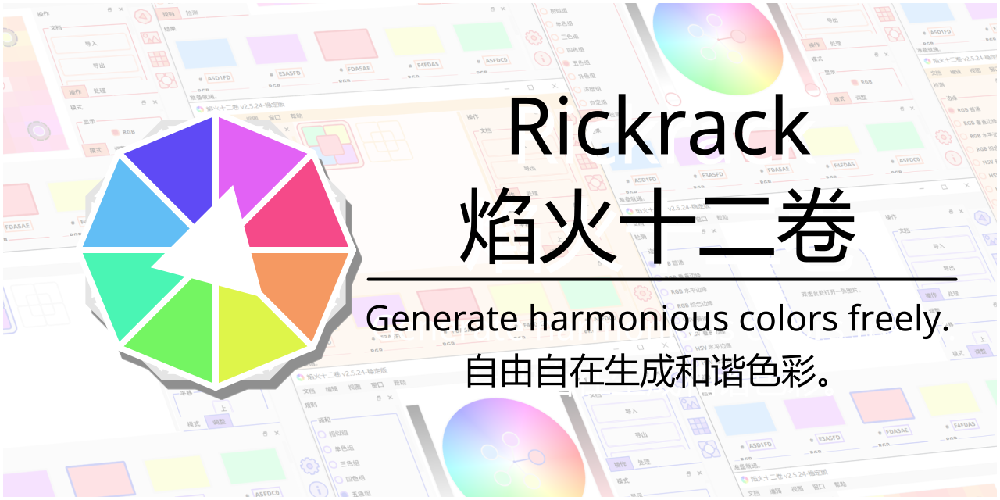

# Rickrack
Rickrack (**R**e**a**l-t**i**me **C**olor **K**it) is a free color editor. It is designed for generating a set of harmonious colors from color wheel or elsewhere. You can share these colors with your friends, or apply them into your creative works.

# 焰火十二卷
焰火十二卷（实时色彩工具箱）是一款免费开源的色彩编辑器。它可以帮助你从色轮或者其他地方生成一组和谐的色彩。你可以将这些色彩分享给其他人，或者应用到你自己的创作当中。



[中文](https://eigenmiao.com/yanhuo/zh.html) | [English](https://eigenmiao.com/yanhuo/en.html) | [日本語](https://eigenmiao.com/yanhuo/ja.html)

# Table of Content
* [Introduction](#introduction)
* [Feature](#feature)
* [Information](#information)
  * [Homepage](#homepage)
  * [Repository](#repository)
  * [Author](#author)
  * [Support](#support)
* [Installation](#installation)
  * [Current Release](#current-release)
  * [Download Software](#download-software)
  * [Install Software](#install-software)
  * [Install Module](#install-module)
* [Usage](#usage)
  * [How to Use the Software](#how-to-use-the-software)
  * [How to Use the Module](#how-to-use-the-module)
  * [Notice](#notice)
* [Development](#development)
  * [Install Requirement](#install-requirement)
  * [Build Software](#build-software)
  * [Build Module](#build-module)
* [Copyright](#copyright)
* [License](#license)
  * [License for Rickrack](#license-for-rickrack)
  * [License for Required Packages](#license-for-required-packages)
* [Acknowledgment](#acknowledgment)

# Introduction
Colors enrich our world and affect our emotions. For artists, they display objects and convey feelings by varied colors in photos, images and drawings. For scientist, they present data by distinguishable colors in figures and graphics. However, currently most color generator softwares and websites place restrictions on users, such as can't export color palette into local individual files, don't provide invocation interfaces, relying on cloud storages, requiring registrations and networks, regional limitations and (or) collecting user's privacies.

Rickrack is designed for you if you are troubled by these restrictions!

Rickrack is a free color editor. It is designed for generating a set of harmonious colors from color wheel or elsewhere. You can share these colors with your friends, or apply them into your creative works. You can store your favorite color sets and color boards in this software, and get them at next time. What's more, you could export color sets or color depots into individual files, backup them anywhere, share them with your friends, or import them into other softwares (such as Adobe Photoshop, GIMP, Krita, Pencil 2D and Clip Studio Paint). Rickrack is written in PyQt5, which performs well on Windows, Linux and other mainstream operating systems.

Rickrack include two parts: software and module. **The Rickrack software** is designed for generating and managing harmonious colors. **The Rickrack module** is designed for obtain colors from software in real-time and plot images combined with other modules (such as Matplotlib and Turtle).

<div align="right"><a href="#table-of-content">[-> Back to TOC <-]</a></div>

# Feature
Rickrack has several features:
* A strong and free color editor.
* Create a set of colors from color wheel.
* Locate a set of colors from image.
* Derive a color board from the color set.
* Attach the color set and color board into depot.
* Import colors from elsewhere and manage them in depot.
* Export colors and import it into other image processors.
* Obtain colors through module in real-time.
* No function limitations and no registration required.
* ... and more!

<div align="right"><a href="#table-of-content">[-> Back to TOC <-]</a></div>

# Information
## Homepage
https://eigenmiao.com/rickrack/

## Repository
https://github.com/eigenmiao/Rickrack

## Author
[Eigenmiao](mailto:eigenmiao@outlook.com)

## Support
[Support the Future of Rickrack!](https://eigenmiao.com/rickrack/support.html)

<div align="right"><a href="#table-of-content">[-> Back to TOC <-]</a></div>

# Installation
## Current Release
The latest stable version is [v2.5.24](https://github.com/eigenmiao/Rickrack/releases/tag/v2.5.24-stable).

## Download Software
https://github.com/eigenmiao/Rickrack/releases/tag/v2.5.24-stable

## Install Software
Visit https://eigenmiao.com/rickrack/ for more information. The installation steps are presented in tutorials.

## Install Module
Install the latest [Rickrack](https://pypi.org/project/Rickrack/) from PyPI!

```Bash
# Install Rickrack.
pip install Rickrack

# Start the installed software.
rickrack -d "/PATH/TO/RICKRACK/SOFTWARE"
```

<div align="right"><a href="#table-of-content">[-> Back to TOC <-]</a></div>

# Usage
## How to Use the Software
Visit https://eigenmiao.com/rickrack/ for tutorials. Just feel free to click anywhere in the interface!

## How to Use the Module
Include Rickrack in other scripts, programs and softwares!

```Python
# Use Rickrack module in code.
# This code fragment could be reused.

from rickrack import Rickrack

# Init Rickrack.
rr = Rickrack()

# Display the help information.
dp_proj = "/PATH/TO/RICKRACK/PROJECT"
dp_argv = dict()
dp_argv["help"] = True

# Run and see the full contents and examples.
rr.run(dp_argv=dp_argv, dp_proj=dp_proj)
```

## Notice
* Please read the documents and tutorials when you encounter problems.
* Please don't open the socket server if you are not familiar with it. It is designed for obtain colors through python module in real-time. This server is disabled by default and can only be started from the command line.

<div align="right"><a href="#table-of-content">[-> Back to TOC <-]</a></div>

# Development
## Install Requirement
* Python 3.6
* Git version control system
* Additional modules listed in requirements folder

## Build Software
Not supported.

## Build Module
```bash
# Download the Rickrack source code.
git clone https://github.com/eigenmiao/Rickrack.git

# Change into the directory.
cd Rickrack

# Generate modules.
python setup.py sdist --formats=gztar,zip
```

<div align="right"><a href="#table-of-content">[-> Back to TOC <-]</a></div>

# Copyright
Copyright (c) 2019-2022 [Eigenmiao](mailto:eigenmiao@outlook.com). All Rights Reserved.

<div align="right"><a href="#table-of-content">[-> Back to TOC <-]</a></div>

# License
## License for Rickrack
Rickrack is a free software, which is distributed in the hope that it will be useful, but without any warranty. You can redistribute it and/or modify it under the terms of the GNU General Public License as published by the Free Software Foundation. See the [GNU General Public License 3.0 (GPL 3.0)](https://www.gnu.org/licenses/) for more details.

All images, documents and translations in Rickrack [code repository](https://github.com/eigenmiao/Rickrack) are licensed under [Creative Commons Attribution-NonCommercial-ShareAlike License 4.0 (CC BY-NC-SA 4.0)](https://creativecommons.org/licenses/by-nc-sa/4.0/) unless stating additionally.

Rickrack default uses [Noto Serif](https://fonts.google.com/specimen/Noto+Serif) ([SC](https://fonts.google.com/specimen/Noto+Serif+SC)) fonts and [Noto Sans](https://fonts.google.com/specimen/Noto+Sans) ([SC](https://fonts.google.com/specimen/Noto+Sans+SC)) fonts for interface display, which are designed by Google and published in website [Google Fonts](https://fonts.google.com/). These fonts are open-sourced under [Apache 2.0](http://www.apache.org/licenses/) and [SIL Open Font License 1.1](http://scripts.sil.org/OFL), respectively.

## License for Required Packages
| Package        | Version  | License        |
|----------------|----------|----------------|
| altgraph       | 0.17.2   | MIT            |
| fbs            | 0.8.9    | GPLv3 or Later |
| future         | 0.18.2   | MIT            |
| lxml           | 4.6.3    | BSD            |
| macholib       | 1.15.2   | MIT            |
| numpy          | 1.19.5   | BSD            |
| pefile         | 2021.9.3 | MIT            |
| Pillow         | 8.4.0    | HPND           |
| pip            | 21.3.1   | MIT            |
| PyInstaller    | 3.4      | GPLv2 or Later |
| PyQt5          | 5.12.1   | GPLv3          |
| PyQt5_sip      | 4.19.19  | SIP            |
| pywin32        | 302      | PSF            |
| pywin32-ctypes | 0.2.0    | BSD            |
| ricore         | 0.0.0    | Private Module |
| setuptools     | 40.6.2   | MIT            |
| swatch         | 0.4.0    | MIT            |

<div align="right"><a href="#table-of-content">[-> Back to TOC <-]</a></div>

# Acknowledgment
* The Rickrack software is written in [Python](https://www.python.org/), constructed based on [PyQt5](https://www.riverbankcomputing.com/software/pyqt/) and packed up by [fbs (free edition)](https://build-system.fman.io/).
* The localization (l10n) and internationalization (i18n) of Rickrack is based on [Google Translate](https://translate.google.cn/) and [Microsoft Translator](https://cn.bing.com/translator), deployed on [POEditor](https://poeditor.com/join/project?hash=kBeQjfxCES).
* The code repository is deposited on [Github](https://github.com/eigenmiao/Rickrack) and [Gitee](https://gitee.com/eigenmiao/Rickrack).

<div align="right"><a href="#rickrack">[-> Back to Top <-]</a> <a href="#table-of-content">[-> Back to TOC <-]</a></div>
