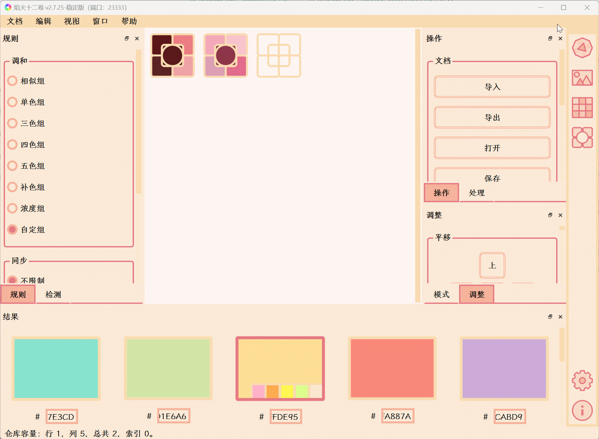
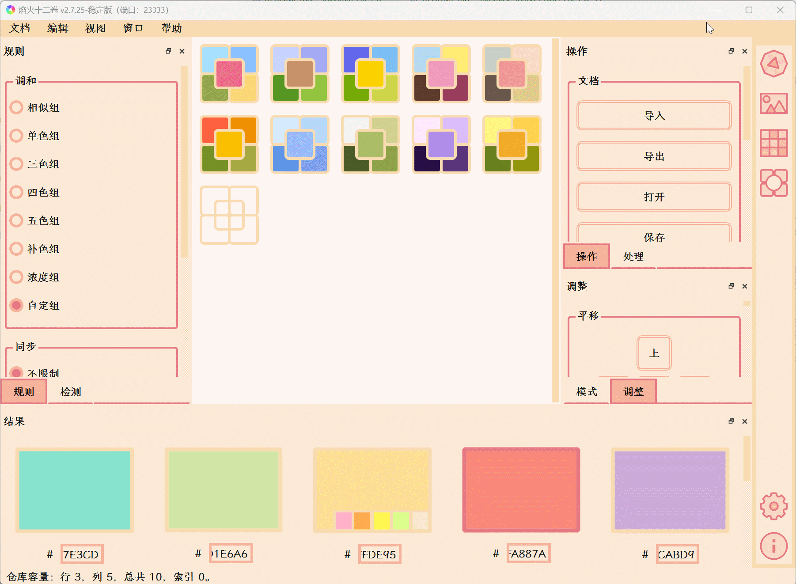

[中文](https://eigenmiao.com/yanhuo/) | [English](https://eigenmiao.com/rickrack/)

This directory contains a color palette with colors from several pictures. Use [Rickrack](https://github.com/eigenmiao/Rickrack) to open or edit the color palette. This demo is published for learning and communication purpose only.

Steps:
1. Install the Rickrack software.

2. Click "Open" and find this color palette.

4. Check the color palette.

Rickrack is a free software, which is distributed in the hope that it will be useful, but without any warranty. You can redistribute it and/or modify it under the terms of the GNU General Public License as published by the Free Software Foundation. See the [GNU General Public License 3.0 (GPLv3)](https://www.gnu.org/licenses/) for more details.

All images, documents and translations in Rickrack [code repository](https://github.com/eigenmiao/Rickrack) are licensed under [Creative Commons Attribution-NonCommercial-ShareAlike License 4.0 (CC BY-NC-SA 4.0)](https://creativecommons.org/licenses/by-nc-sa/4.0/) unless stating additionally.

Rickrack default uses [Noto Sans](https://fonts.google.com/noto) font family for interface display. These fonts are open-sourced under [SIL Open Font License 1.1](http://scripts.sil.org/OFL). Rickrack only carries basic fonts. All fonts can be downloaded here: [all fonts](https://fonts.google.com/noto/fonts).

Please visit https://github.com/eigenmiao/Rickrack for more infomation about Rickrack.

Copyright (c) 2019-2023 by Eigenmiao. All Rights Reserved.
