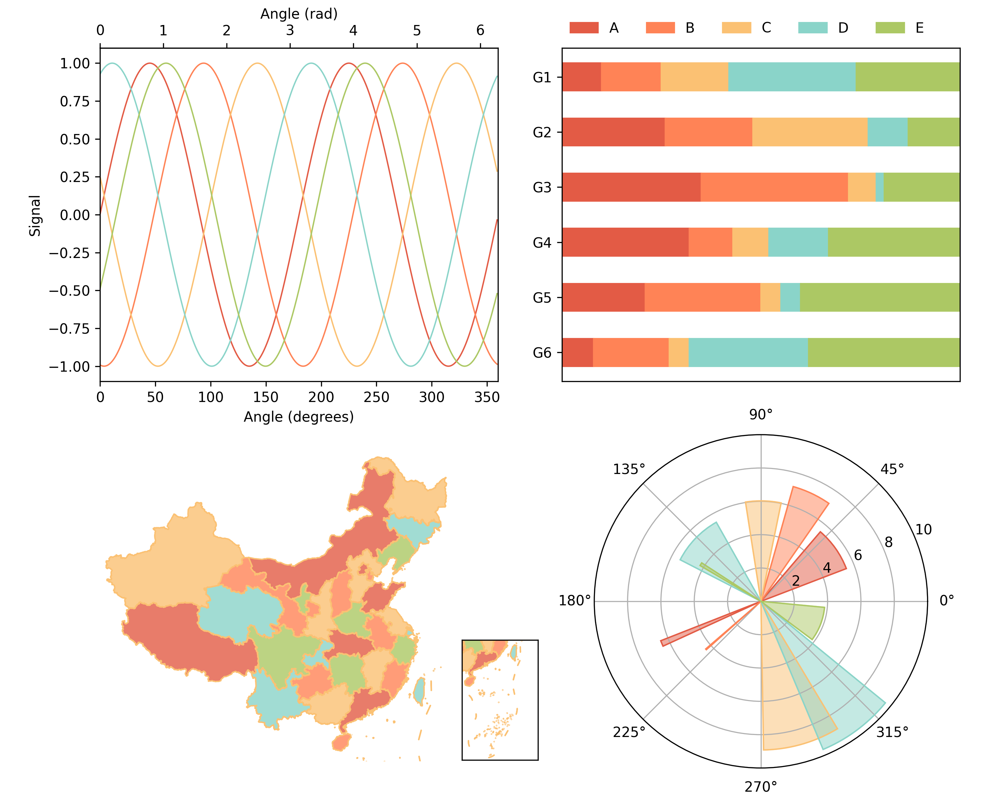

[中文](https://eigenmiao.com/yanhuo/zh.html) | [English](https://eigenmiao.com/yanhuo/en.html) | [日本語](https://eigenmiao.com/yanhuo/ja.html)

This directory contains a demo for using the [Rickrack software and module](https://github.com/eigenmiao/Rickrack). It plots curves, bars, maps and polar bars with colors from the Rickrack. The colors can be modified by the Rickrack module in real-time.

Here is a [video tutorial](https://www.bilibili.com/video/BV1VD4y157tX/).

Steps:
1. Install the Rickrack software.

2. Install the Python modules.
```
pip install rickrack
pip install numpy matplotlib basemap
```

3. Run the demo script.
```
python diagram.py
```

4. Check the finall result.


Rickrack is a free software, which is distributed in the hope that it will be useful, but without any warranty. You can redistribute it and/or modify it under the terms of the GNU General Public License as published by the Free Software Foundation. See the [GNU General Public License 3.0 (GPL 3.0)](https://www.gnu.org/licenses/) for more details.

All images, documents and translations in Rickrack [code repository](https://github.com/eigenmiao/Rickrack) are licensed under [Creative Commons Attribution-NonCommercial-ShareAlike License 4.0 (CC BY-NC-SA 4.0)](https://creativecommons.org/licenses/by-nc-sa/4.0/) unless stating additionally.

Rickrack default uses [Noto Serif](https://fonts.google.com/specimen/Noto+Serif) ([SC](https://fonts.google.com/specimen/Noto+Serif+SC)) fonts and [Noto Sans](https://fonts.google.com/specimen/Noto+Sans) ([SC](https://fonts.google.com/specimen/Noto+Sans+SC)) fonts for interface display, which are designed by Google and published in website [Google Fonts](https://fonts.google.com/). These fonts are open-sourced under [Apache 2.0](http://www.apache.org/licenses/) and [SIL Open Font License 1.1](http://scripts.sil.org/OFL), respectively.

Please visit https://github.com/eigenmiao/Rickrack for more infomation about Rickrack.

Copyright (c) 2019-2023 by Eigenmiao. All Rights Reserved.
