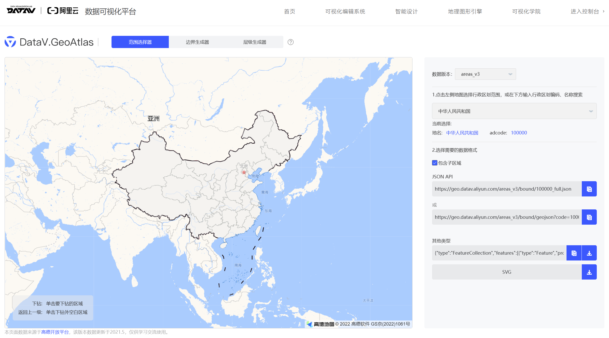

This directory contains the map data of People's Republic of China (PRC). This data is obtained from Aliyun, updated in 2021.5 and published for learning and communication purpose only.

See http://datav.aliyun.com/portal/school/atlas/area_selector for more information.

该目录包含中华人民共和国（PRC）的地图数据。该数据来源于阿里云，更新于 2021.5 且仅供学习交流使用。

浏览 http://datav.aliyun.com/portal/school/atlas/area_selector 获取更多信息。

