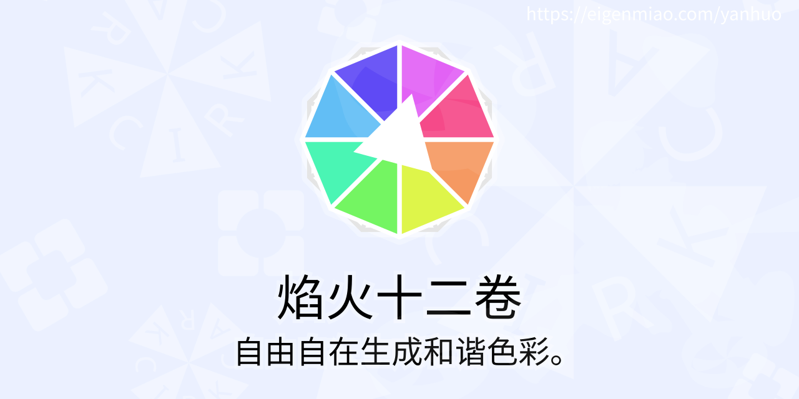
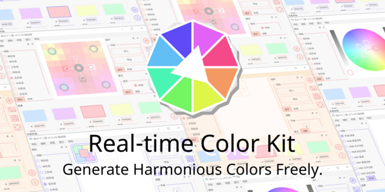
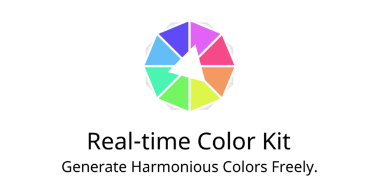
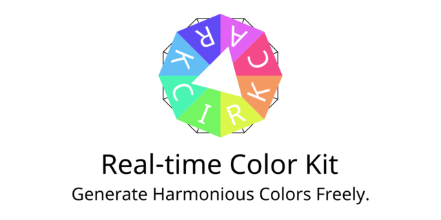
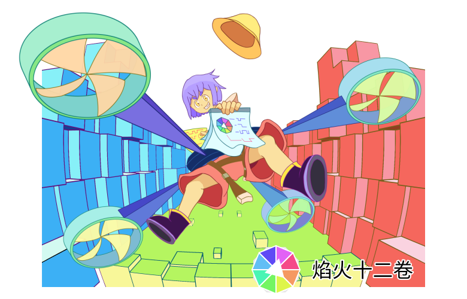
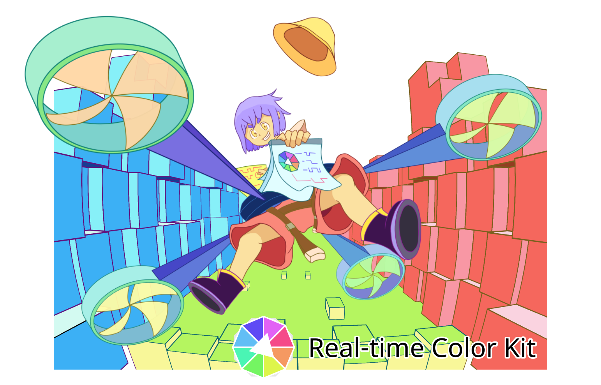

[中文](https://eigenmiao.com/yanhuo/zh.html) | [English](https://eigenmiao.com/yanhuo/en.html) | [日本語](https://eigenmiao.com/yanhuo/ja.html)

This directory contains resource images required by [Rickrack](https://github.com/eigenmiao/Rickrack).

Images with name start with "icon" or "file" are licensed under [Creative Commons Attribution-NonCommercial-ShareAlike License 4.0 (CC BY-NC-SA 4.0)](https://creativecommons.org/licenses/by-nc-sa/4.0/).

* Software and file icon images (CC BY-NC-SA 4.0)

Images with name start with "repository" are licensed under [Creative Commons Attribution-NonCommercial-ShareAlike License 4.0 (CC BY-NC-SA 4.0)](https://creativecommons.org/licenses/by-nc-sa/4.0/).

* Current repository images (CC BY-NC-SA 4.0)

* Repository images for v2.5.24 (CC BY-NC-SA 4.0)

* Repository images for v2.4.9 (CC BY-NC-SA 4.0)

Images with name start with "design" are copyrighted to [Eigenmiao](mailto:eigenmiao@outlook.com). All Rights Reserved.

* Current splash images (All Rights Reserved)

* Splash images for v2.5.24 (All Rights Reserved)

